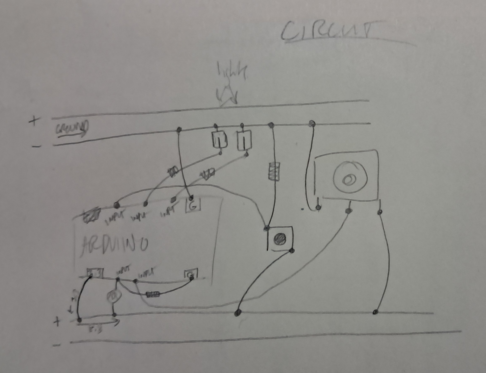

# HW12

 What I did here was basically combine the three tools we used in the last class into one machine. This homework is on the simpler side because I was travelling for Thanksgiving and realized too late that I did not have nearly enough wires for everything to work together! So I wrote the pseudocode for it, then had to wait until I was back in New York to get more stuff from the Makerspace and troubleshoot my code. Everything ended up working, although I would have liked to use something other than the light sensor for my third input (unfortunately, the Makerspace was out of everything else). My "solution" to the sensitivity of the light sensor and the potentiometer was to have the correct placement just be at extreme ends of their spectrums, so the light is only correct if absolutely no light gets in. In my test video, it was apparently already low enough light that the sensor was sitting around 0 anyways, so you can see the red light kind of flickering on and off.

  
